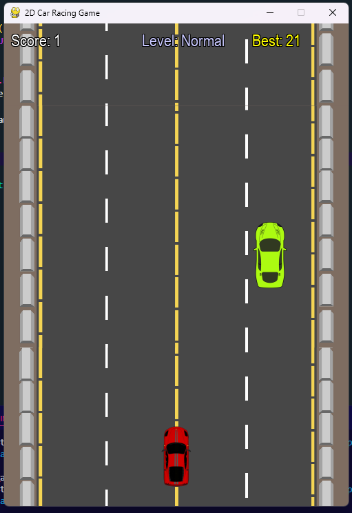
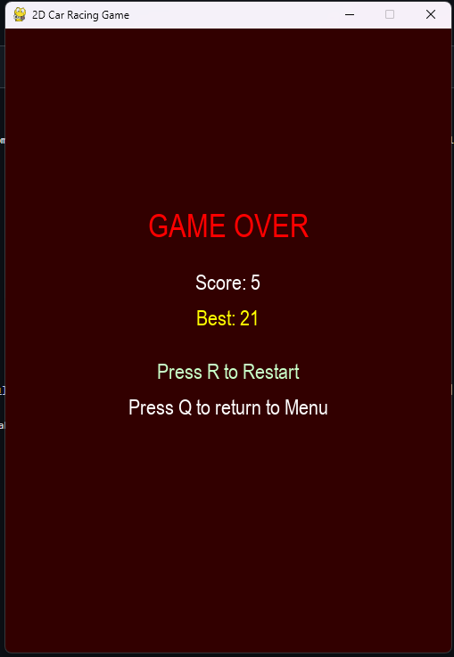
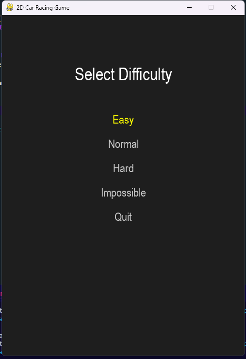

# 🏎️ 2D Car Racing Game

A fast-paced, arcade-style 2D car racing game built using **Python** and **Pygame**. Dodge incoming traffic, rack up points, and test your reflexes across four difficulty levels!

---

## 📸 Screenshots

| Gameplay | Game Over | Menu | Difficulty Options | Scoreboard |
|----------|-----------|------|--------------------|------------|
|  |  |  |  |  |


> 📝 **Note**: Place your screenshots in a folder named `screenshots/` in your project root. Update the file names or paths if you change the names of the images.

---

## 🎮 Features

- Smooth scrolling road background  
- Player car control with left/right arrow keys  
- Randomized enemy car appearances  
- Four difficulty levels: Easy, Normal, Hard, Impossible  
- Score tracking and best score persistence (saved to `best_score.txt`)  
- Game Over screen with restart or return-to-menu options  
- Stylized text rendering with outline for better readability

---

## 🛠️ How to Run

1. **Clone this repo:**

```bash
git clone https://github.com/rohan-rusho/car-racing-game.git
cd car-racing-game


2. **Install Pygame (if not already):**

```bash
pip install pygame
```

3. **Run the game:**

```bash
python car_racing_game.py
```

---

## 📁 Folder Structure

```
car-racing-game/
├── assets/
│   ├── road.png
│   ├── car.png
│   ├── car1.png
│   ├── car2.png
│   ├── car3.png
│   ├── car4.png
│   └── car5.png
├── best_score.txt
├── car_racing_game.py
├── screenshots/
│   ├── screenshot1.png
│   ├── screenshot2.png
│   ├── screenshot3.png
│   ├── screenshot4.png
│   └── screenshot5.png
└── README.md
```

---

## ⚙️ Controls

| Action        | Key           |
| ------------- | ------------- |
| Move Left     | ← Left Arrow  |
| Move Right    | → Right Arrow |
| Navigate Menu | ↑ ↓ + Enter   |
| Restart Game  | R             |
| Quit to Menu  | Q             |

---

## 💡 Difficulty Levels

| Level      | Enemy Speed | Speed Increase |
| ---------- | ----------- | -------------- |
| Easy       | 3           | 0.1            |
| Normal     | 5           | 0.2            |
| Hard       | 7           | 0.3            |
| Impossible | 10          | 0.5            |

---

## 🧠 Game Logic Overview

- Game starts with a main menu offering difficulty choices.  
- The player's car is fixed at the bottom of the screen and can move left/right.  
- Enemy cars fall from the top of the screen at increasing speeds based on the selected difficulty.  
- Collision detection ends the game and displays the Game Over screen.  
- The score is incremented for every enemy car avoided.  
- The highest score is saved in `best_score.txt` and loaded each session.

---

## 📌 Notes

- This game is designed for learning and fun — feel free to expand it with sound effects, more obstacles, or power-ups!  
- Ensure that all asset images are located in the `assets/` folder.  
- Screenshots used in this README are located in the `screenshots/` folder. Replace or update them as needed.

---

## 👤 Author

**Md. Rohan Islam**  
📧 `ahmedrohan920@gmail.com`  
🌐 GitHub: [rohan-rusho](https://github.com/rohan-rusho)

---

## 📄 License

This project is open-source and free to use for educational or personal purposes. Attribution is appreciated but not required.
